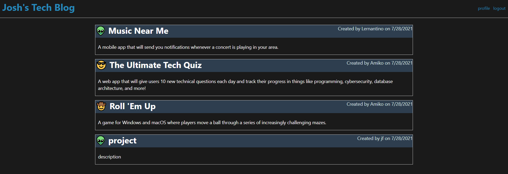

# 14 Model-View-Controller (MVC): Tech Blog

## Description
This is a tech blog where users can make posts and comment on other posts to discuss any topic focused on tech.

## Technologies Used
- Sequelize
- MySQL
- Node.js
- Handlebars.js
- Express.js

## Usage
To run locally...  
`npm i `  
`npm run seed` (optional) 
`npm run start`  

## Deployed Application

https://josh-tech-blog.herokuapp.com/

## Screenshot

